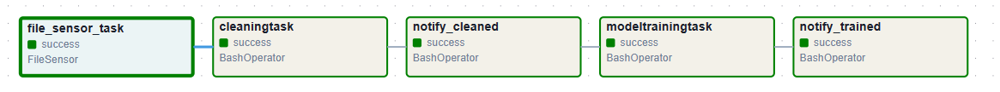

# Immo Eliza with Airflow
[](https://img.shields.io/badge/Airflow-017CEE?style=for-the-badge&logo=Apache%20Airflow&logoColor=white)
[](https://img.shields.io/badge/Docker-2CA5E0?style=for-the-badge&logo=docker&logoColor=white)
[](https://img.shields.io/badge/Pandas-2C2D72?style=for-the-badge&logo=pandas&logoColor=white)
[](https://img.shields.io/badge/scikit_learn-F7931E?style=for-the-badge&logo=scikit-learn&logoColor=white)

## Table of Contents

- [Info 📝](#📝-info)
- [File Structure 🤖](#🤖-file-structure)
- [The Docker file 🤖](#🤖-the-docker-file)
- [Installation 🛠](#🛠-installation)
- [DAG tasks 🚀](#🚀-dag-tasks)
- [Airflow Information 🔍](#🔍-airflow-information)
- [Timeline🕐 ](#🕐-timeline)


## 📝 Info

This airflow pipeline combines the code from previous projects that were tackled at BeCode on the immo eliza usecase.
Instead of having all the code in different repo's, the code is combined in this repo to be able to easily make an Airflow DAG.

The projects consisted out of:

1. scraping immoweb (https://github.com/NathNacht/immo-eliza-scraping-immozila)
2. cleaning data (https://github.com/NathNacht/immo-eliza-scraping-immozila-Cleaning-EDA)
3. creating a model (https://github.com/NathNacht/immo-eliza-ml)
4. training the model (https://github.com/NathNacht/immo-eliza-ml)
5. deploying the model (https://github.com/NathNacht/immo-eliza-deployment)

For this airflow DAG project we used Airflow version 2.9.0.

The integrated steps of the previous projects are: Cleaning the data, creating and training the model.

The predict_with_pipeline.py is also already available and could be implemented in a dag task as well.

## 🤖 File Structure 

```
├── Dockerfile
├── README.md
├── config
│   └── airflow.cfg
├── dags
│   ├── __init__.py
│   ├── dag_clean_train.py
├── docker-compose.yaml
├── image.png
├── plugins
├── project
│   ├── data
│   │   ├── cleaned
│   │   │   ├── clean_app.csv
│   │   │   └── clean_house.csv
│   │   ├── models
│   │   │   ├── rfr_app_model_with_pipeline.pkl
│   │   │   └── rfr_house_model_with_pipeline.pkl
│   │   └── raw
│   │       ├── georef-belgium-postal-codes.csv
│   │       ├── raw_apartement_te_koop.csv
│   │       ├── raw_huis_te_koop.csv
│   │       └── zipcodes_alpha_nl_new.csv
│   ├── immo-eliza-1scraping
│   │   └── __init__.py
│   ├── immo-eliza-2cleaning
│   │   ├── __init__.py
│   │   └── clean.py
│   └── immo-eliza-model
│       ├── __init__.py
│       ├── predict_with_pipeline.py
│       └── train_with_pipeline.py
└── requirements.txt
```

## 🤖 The Docker file

A Dockerfile is needed to build the image.

In order to add custom dependencies an extended image is used instead of the default one.
The requirements.txt contains the additional dependencies that will be installed in the image.
  
```bash
FROM apache/airflow:2.9.0
ADD requirements.txt .
RUN pip install apache-airflow==${AIRFLOW_VERSION} -r requirements.txt
```

## 🛠 Installation

### Prerequisites:
- have docker installed
- have docker compose installed

### Installation instructions
* clone the repo
```bash
git clone git@github.com:NathNacht/immo-eliza-airflow.git
```

* Making sure your user has root permissions (a .env is created)
```bash
echo -e "AIRFLOW_UID=$(id -u)" > .env
```

* Running airflow-init

```	bash
docker compose up airflow-init
```

* Starting the remaining services

```	bash
docker compose up
``` 

* Airflow GUI is now available at: http://localhost:8080/

# 🚀 DAG tasks

These are the dag tasks that were used in this project
* file_sensor_task - checks if a raw input file exists to start the cleaning
* cleaningtask - cleans the data to be usable for model creation
* notify_cleaned - a notification is done that the cleaning process ended
* modeltrainingtask - training and building the model (results in the creation of 2 .pkl files)
* notify_trained - a notification is done that the training process ended



# 🔍 Airflow Information

Adding some more information on airflow as this project was a good introduction into working with Airflow

### Sources

https://www.youtube.com/watch?v=Sva8rDtlWi4 to have a first working Airflow version

### Prerequisites:
- have docker installed
- have docker compose installed

### Steps followed

Airflow should NOT be installed locally!! This is done through the docker-compose file

1. From https://airflow.apache.org/docs/apache-airflow/stable/howto/docker-compose/index.html fetched the docker-compose.yaml file

```	bash
curl -LfO 'https://airflow.apache.org/docs/apache-airflow/2.9.0/docker-compose.yaml'
```

This file contains several service definitions:

- ```airflow-scheduler``` - The scheduler monitors all tasks and DAGs, then triggers the task instances once their dependencies are complete.
- ```airflow-webserver``` - The webserver is available at http://localhost:8080.
- ```airflow-worker``` - The worker that executes the tasks given by the scheduler.
- ```airflow-triggerer``` - The triggerer runs an event loop for deferrable tasks.
- ```airflow-init``` - The initialization service.
- ```postgres``` - The database.
- ```redis``` - The redis - broker that forwards messages from scheduler to worker.

2. Creation config, dags, logs and plugins folder and set AIRFLOW_UID

Creation of an .env file with the AIRFLOW_UID = 1000. This is the user id of the host user (to be found in /etc/passwd). We need to place it here so our user has root permissions to run and trigger commands (when working with docker-compose)

```	bash
mkdir -p ./dags ./logs ./plugins ./config
echo -e "AIRFLOW_UID=$(id -u)" > .env
# or
echo -e "AIRFLOW_UID=$(id -u)\nAIRFLOW_GID=0" > .env
```

3. Running airflow-init

```	bash
docker compose up airflow-init
```

4. Starting the remaining services

```	bash
docker compose up
``` 

Airflow GUI is now available at: http://localhost:8080/


5. Tear down the environment

```	bash
docker compose down --volumes --remove-orphans
# or
docker compose down --volumes --rmi all
```

6. Troubleshooting

Logging in into a running container:

```	bash
docker compose exec airflow-worker /bin/bash
```

Connecting to the postgres database:

```	bash
docker compose exec postgres psql -U airflow -d airflow
```

7. Issues encountered/Learnings

* Do not store python scripts that contain logic for the DAG's in the plugins folder (result will be that these will be executed at ```docker compose up```)


* Better to use ```from airflow.sensors.base import BaseSensorOperator``` and created a new class called FileSensor instead of using ```from airflow.sensors.filesystem import FileSensor```


## 🕐 Timeline

This project was created in 4 days.


